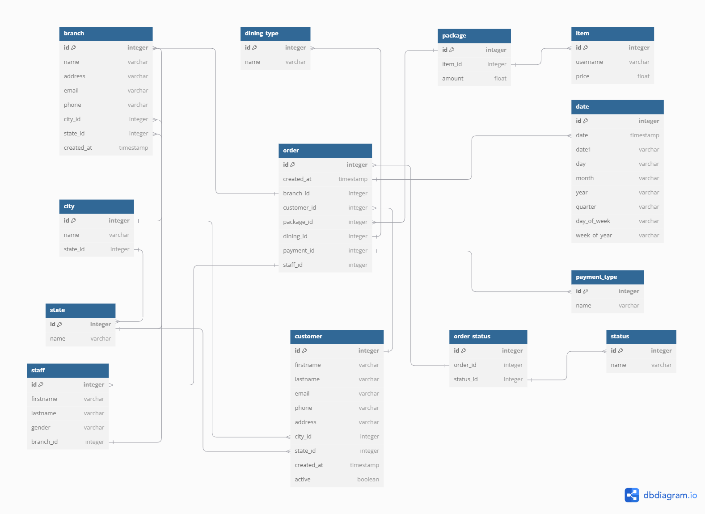

# Modelling (ERD) Assignment

This assignment is part of the requirement to fulfill the participation in the **CDE BootCamp Cohort 1**

### Task: Design a simple ERD for Fufu Republic

#### Overview
Fufu Republic is a popular restaurant chain in Nigeria with multiple outlets nationwide. While the core menu is standardized, some items vary by location 
(e.g., the Agege branch may sell Chinese Rice, while the Lekki branch might not). Customers can order online through the website or visit outlets for dine-in
 or take-out.
 
Payment Methods accepted includes 
- Cash
- Debit card payments via Nomba POS terminals at outlets
- Online payments processed through gateways like Nomba Web Checkout, Paystack, Interswitch etc.

#### Methodology

This involves understanding the business requirements and creating the necessary tables, then linking them via Entity-Relationship Diagram as seen below...

The following tables have been created, `order`, `payment`, `package`, `item`, `customer`, `branch`, `staff`, `date`, `dining_type`, `order_status`, `status`,
`city` and `state`,  with the required columns within as seen above to capture the necessary data and show business insights.

#### Business Questions 

1. What is the quantity ordered at each branch?

2. What dining type is popular across the various branches?

3. What is the total revenue by branches?

4. What item is most ordered at various branches?

5. Which staff has the highest number of completed orders?
	
**N.B:** The `case_study_pdf` for this project is provided within.
